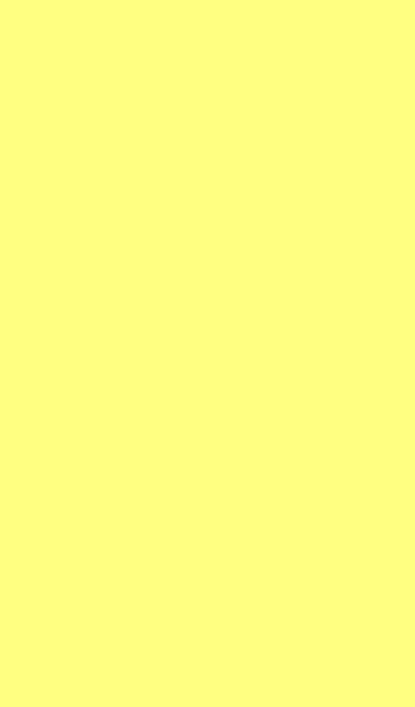
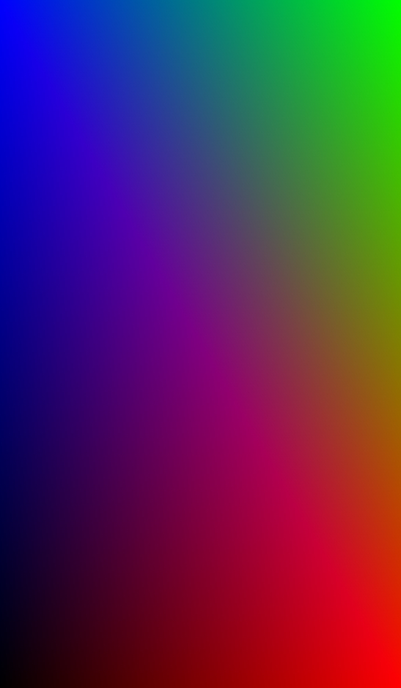

# HelloAgainMetal

## step 1

> metal을 사용하여 화면에 노란색을 칠해봅니다.

## step 2

> metal shader를 사용하여 사각형 각 vertex에 color를 설정하여 그라데이션 된 색을 칠해봅시다.

(참고 문서 : https://www.raywenderlich.com/9211-moving-from-opengl-to-metal#toc-anchor-009)
